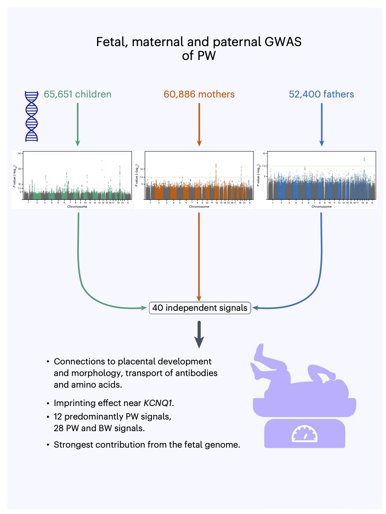

# Background

## DNA and SNPs

- Variation in DNA

- 90% of variation in DNA are SNP: single nucleotide polymorphism. Different base at a single position in the DNA

- Humans: $\pm$ 5 million SNPs

- Most of them are neutral: high redundancy in the genomic code

- Sometimes they are not neutral:

{width=25%}{width=75%}

- Genomic recombination of parental chromosomes when producing germ cells. 

- Linkage disequilibrium: SNPs often occur together because of genomic recombination!

## GWAS in Bergen 

- GWAS: Genome Wide Association Studies
- Studies in large cohorts
- Use SNPs to identify genes associated with a particular trait: e.g. birth weight, pacenta weight, BMI, ... .

# Linear models for GWAS

Let $\mathbf{Z}$ be an $N\times M$ genetic relationship matrix with all $M$ normalised genotypes. 
Then with the SVD we can decompose $\mathbf{Z}$

$$
\mathbf{Z} = \mathbf{U}\boldsymbol{\Delta}\mathbf{V}^T
$$
Note, that the $N\times M$ matrix $\mathbf{V}$ are also the M PCs of an PCA. 
So we can approximate $\mathbf{Z}$ using a truncated PCA, e.g. by using the first $p$ PCs. 
$$
\mathbf{Z}_p = \mathbf{U}_{p} \boldsymbol{\Delta}_p\mathbf{V}^T_p
$$
with 

$$
\mathbf{X}_\text{PCA} = \mathbf{U}_{p} \boldsymbol{\Delta}_p
$$
the scores on the first p PCs that can be used to correct for population stratification. 

Hence, with a traditional approach we correct for population stratification using the following linear model. 

$$
\tag{1}
\mathbf{y} = \mathbf{x}_\text{test}\beta_\text{test} + \mathbf{X}_c\boldsymbol{\beta}_c + \mathbf{X}_\text{PCA} \boldsymbol{\beta}_\text{PCA} +\boldsymbol{\epsilon} 
$$
with 

- $\mathbf{y}$ an $N\times1$ vector of the phenotype
- $\mathbf{x}_\text{test}$ an $N\times1$ vector with the genotype for the candidate SNP
- $\beta_\text{test}$ the association of candidate SNP and the phenotype
- $\mathbf{X}_c$ an $N\times C$ matrix with the covariate pattern for $C$ known covariates (vector of ones (intercept), age, gender, batch,...) 
- $\boldsymbol{\beta}_c$ the $p\times 1$ vector of parameters modeling the association of the p covariates and the phenotype. 
- $\mathbf{X}_\text{PCA}$ an $N\times p$ matrix with p PCs used to correct for population stratification
- $\boldsymbol{\epsilon}$ an $N\times 1$ vector with environmental residuals that are assumed to be i.i.d.  $\epsilon_i \sim N(0,\sigma_u^2)$ with $i = 1\ldots N$

# Linear mixed model for GWAS

## Specification

$$
\tag{1}
\mathbf{Y} = \mathbf{x}_\text{test}\beta_\text{test} + \mathbf{X}_c\boldsymbol{\beta}_c + \mathbf{Z}_{GRM}\mathbf{u} +\boldsymbol{\epsilon} 
$$
with 

- $\mathbf{Y}$ an $N\times1$ vector of the phenotype
- $\mathbf{x}_\text{test}$ an $N\times1$ vector with the genotype for the candidate SNP
- $\beta_\text{test}$ the association of candidate SNP and the phenotype
- $\mathbf{X}_c$ an $N\times p$ matrix with the covariate pattern for $C$ known covariates (vector of ones (intercept), age, gender, batch,...) 
- $\boldsymbol{\beta}_c$ the $p\times 1$ vector of parameters modeling the association of the p covariates and the phenotype. 
- $\mathbf{Z}$ an $N\times M$ genetic relationship matrix (GRM) with all normalised genotypes
- $\mathbf{u}$ an $M\times 1$ vector with i.i.d. random effect for each SNP $\mathbf{u}\sim \text{MVN}(0,\mathbf{I}\sigma_u^2)$
- $\boldsymbol{\epsilon}$ an $N\times 1$ vector with environmental residuals that are assumed to be independent of $\mathbf{u}$ and i.i.d.  $\boldsymbol{\epsilon}\sim \text{MVN}(0,\mathbf{I}\sigma_\epsilon^2)$

Random effects are used to model the correlation structure in the data. They imply a certain covariance structure of $\mathbf{y}$

## Covariance structure

Covariance structure of $\mathbf{y}$ implied by GWAS mixed model: 

$$
\begin{array}{ccl}
\text{var}\left[\mathbf{Y}\right] &=& \text{var}\left[\mathbf{x}_\text{test}\beta_\text{test} + \mathbf{X}_c\boldsymbol{\beta}_c + \mathbf{Z}_\text{GRM}\mathbf{u} +\boldsymbol{\epsilon}\right]\\\\
&\updownarrow& \mathbf{u} \perp \boldsymbol{\epsilon}\\\\
&=& \text{var}[\mathbf{Z}_\text{GRM}\mathbf{u}] + \text{var}[\boldsymbol{\epsilon}]\\\\
&=&\mathbf{Z}_\text{GRM}\text{var}[\mathbf{u}]\mathbf{Z}_\text{GRM}^T + \mathbf{I} \sigma^2\\\\
&=&\mathbf{Z}_\text{GRM}\mathbf{I}\sigma^2_u\mathbf{Z}_\text{GRM}^T + \mathbf{I} \sigma^2_\epsilon \\\\
&=&\mathbf{Z}_\text{GRM}\mathbf{Z}_\text{GRM}^T \sigma^2_u+ \mathbf{I} \sigma^2_\epsilon
\end{array}
$$

Note that the model is often also written in another way:

$$
\tag{1}
\mathbf{Y} = \mathbf{x}_\text{test}\beta_\text{test} + \mathbf{X}_c\boldsymbol{\beta}_c + \mathbf{g} +\boldsymbol{\epsilon} 
$$

- with $\mathbf{g} \sim \text{MVN}(\mathbf{0},\mathbf{K}\sigma^2_g)$ 

- $\mathbf{K}$ the $N \times N$ empirical kinship matrix 

$$
\mathbf{K} = \frac{\mathbf{Z}_\text{GRM}\mathbf{Z}^T_\text{GRM}}{M} 
$$ 

- $\sigma_g^2$ the polygenic variance $\sigma_g^2=M\sigma_u^2$

## Main advantages of LMM method

1. Better control of false positive associations by correcting for population or relatedness structure 
2. An increase in power: 
- Through the correction for this structure. 
- by conditioning on associated loci other than the candidate locus. 

## Pitfalls of LMM

1. Computational complexity: 

  - $M > 500.000$, $N > 70000$
  - Building the GRM ($M \times M$ matrix)
  - Estimating the mean and variance components  for each of the $M$ candidate SNP! 
  - Association statistics for each variant (for each SNP!)

2. Loss in power when the candidate marker is included in the GRM

3. Using a small subset of markers in the GRM can compromise correction for stratification

